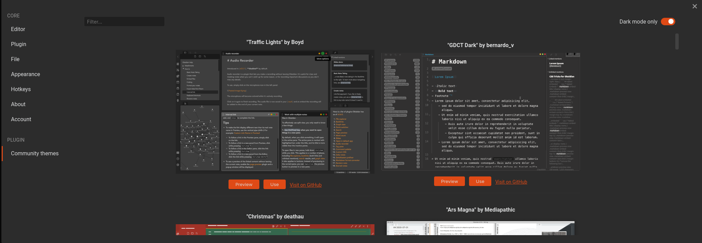

# Obuntu
A theme for Obsidian, inspired by and borrowing elements from Ubuntu for deeper integration with this popular Linux distribution

## Features

- light and dark themes
- modern design with great color integration with Ubuntu
- beauty fonts: [Roboto](https://fonts.google.com/specimen/Roboto) and [Fira Code](https://fonts.google.com/specimen/Fira+Code) for better experience
- colors tags
- indentation lines
- custom checklist
- more expressive tables
- better vim mode colors
- responsive Community Themes page for better experience in wide screen (screenshot below)
 
 ## More Screenshots

 

 

 ### Community Theme page with responsive experience

  