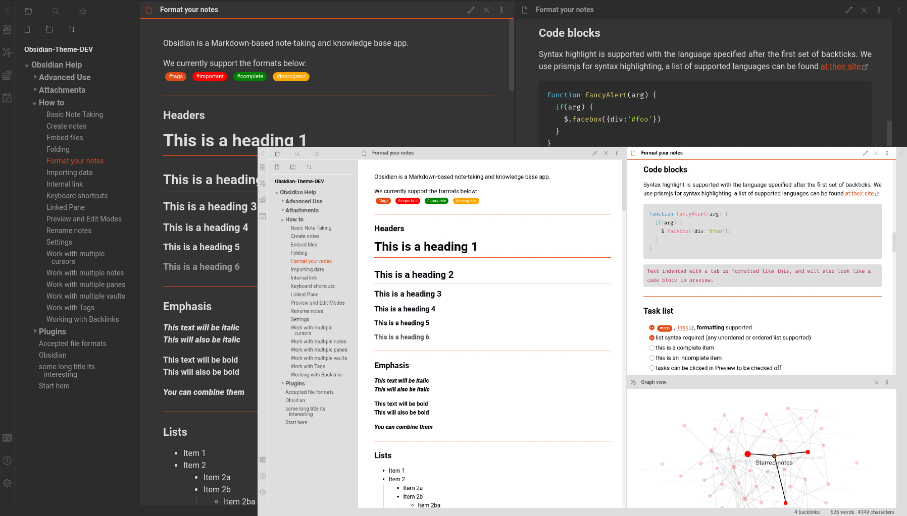
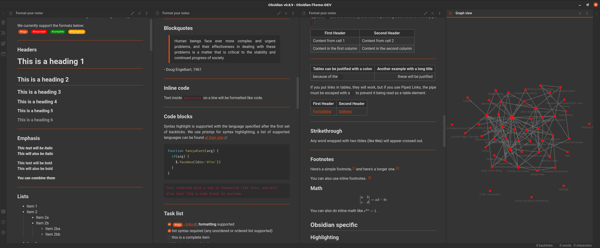
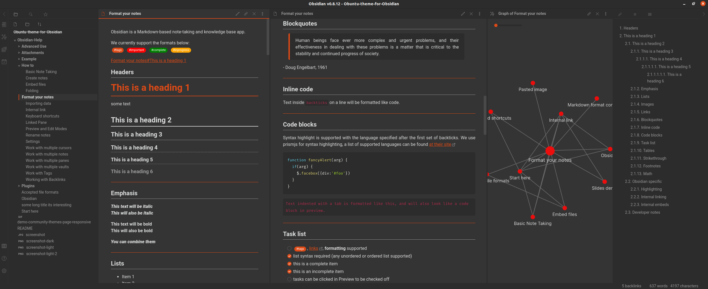
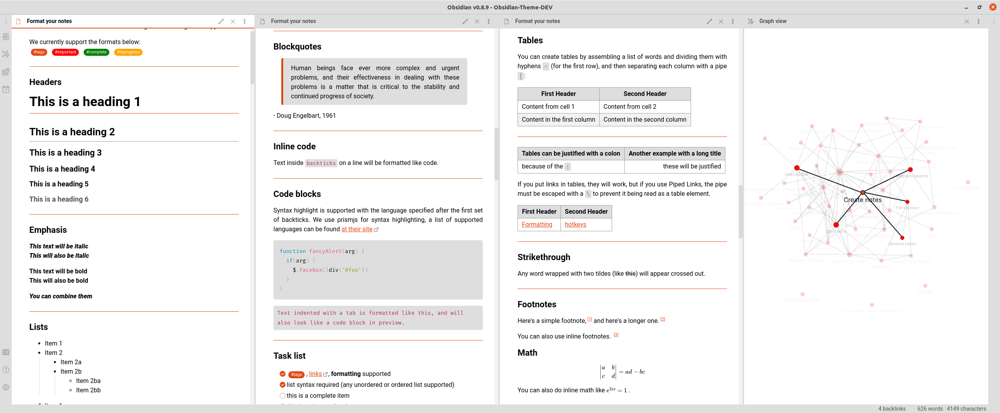
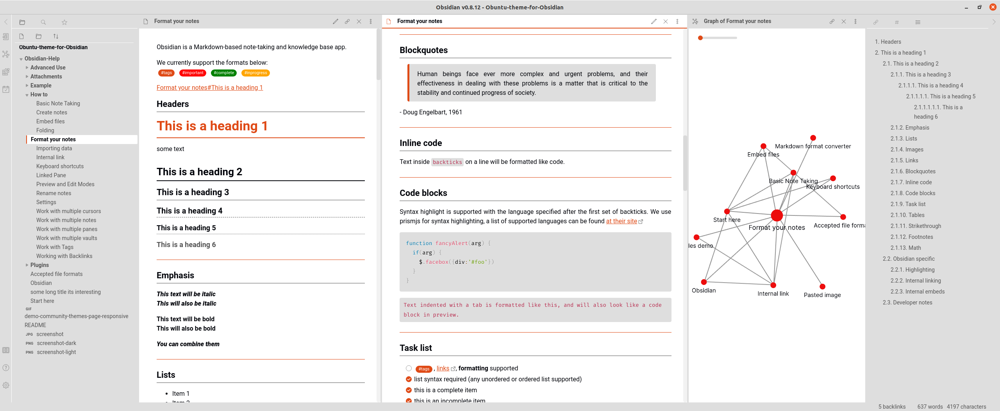
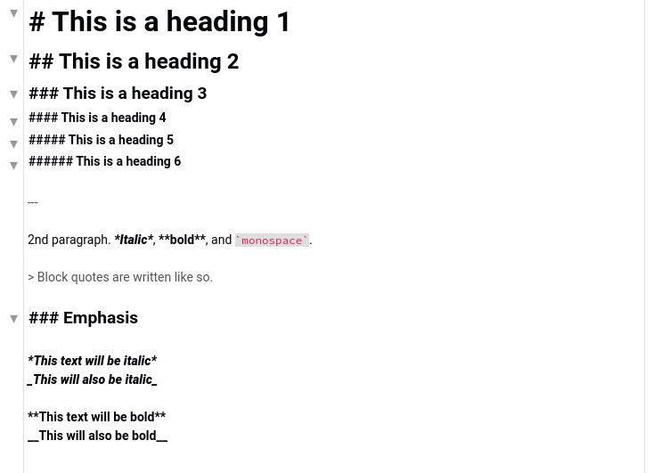
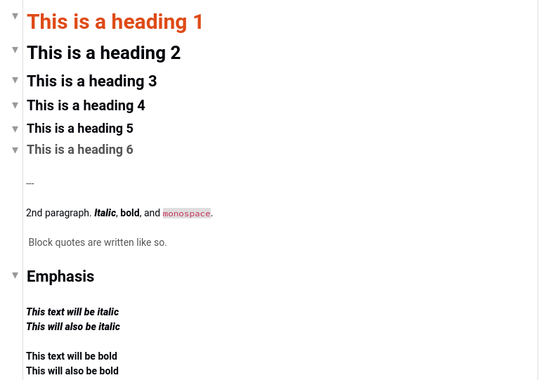
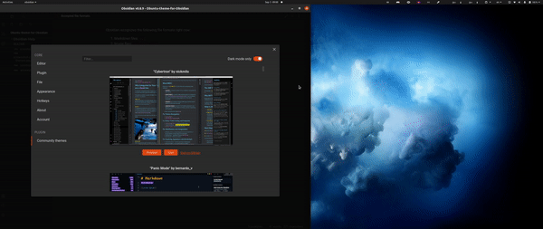

# Obuntu
A theme for Obsidian, inspired by and borrowing elements from Ubuntu for deeper integration with this popular Linux distribution

Thanks to [cannibalox](https://github.com/cannibalox) and his theme
[Obsdn-dark-rmx](https://github.com/cannibalox/Obsdn-dark-rmx) for a lot of ideas and features that were used for better experience in Obuntu theme.

## Features

- light and dark themes
- modern design with great color integration with Ubuntu
- beauty fonts: [Roboto](https://fonts.google.com/specimen/Roboto) and [Fira Code](https://fonts.google.com/specimen/Fira+Code) for better experience
- colors tags in edit view and custom tags look in panel (thanks Klaas for idea and some realization) 
- indentation lines
- custom checklist
- more expressive tables
- better vim mode colors
- responsive Community Themes page for better experience in wide screen (demo below)
- **Clutter Free edit mode**: inline formatting, most of hashes disappears if not active line. Code blocks, list markers and html tags have old behavior to better visually distinguish them from regular text (screenshots below).
 
 ## More Screenshots

### Dark Theme

 
 

### Light Theme

 
 

### Clutter Free edit mode:
**Before**:

**After**:

 ### Community Theme page with responsive experience

  

